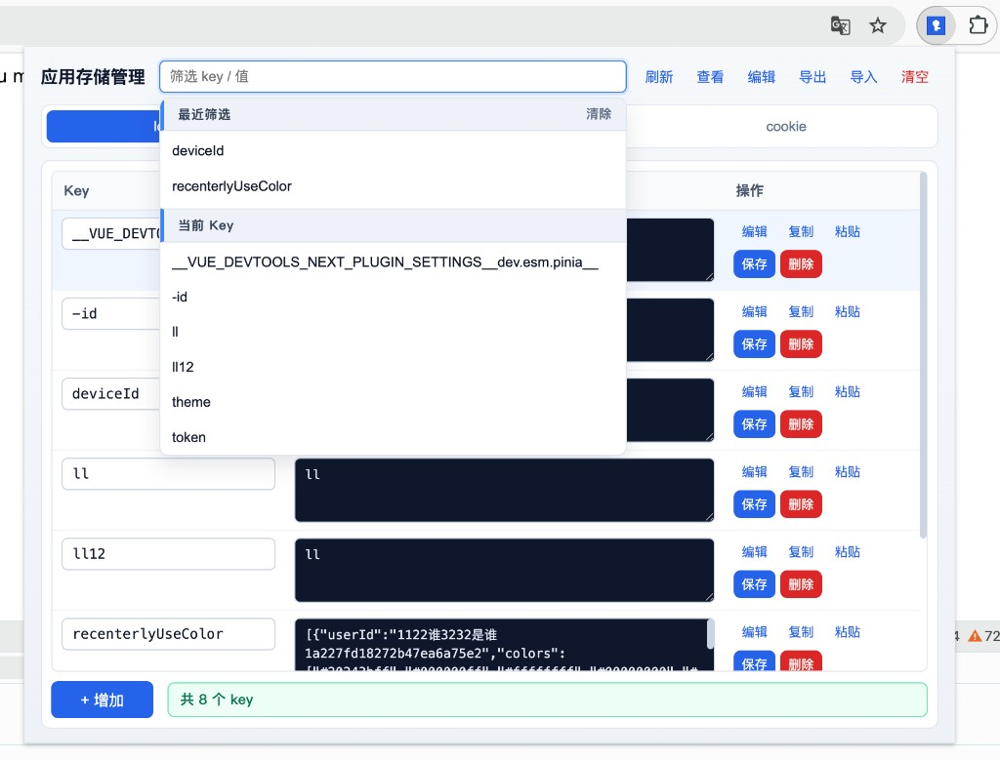
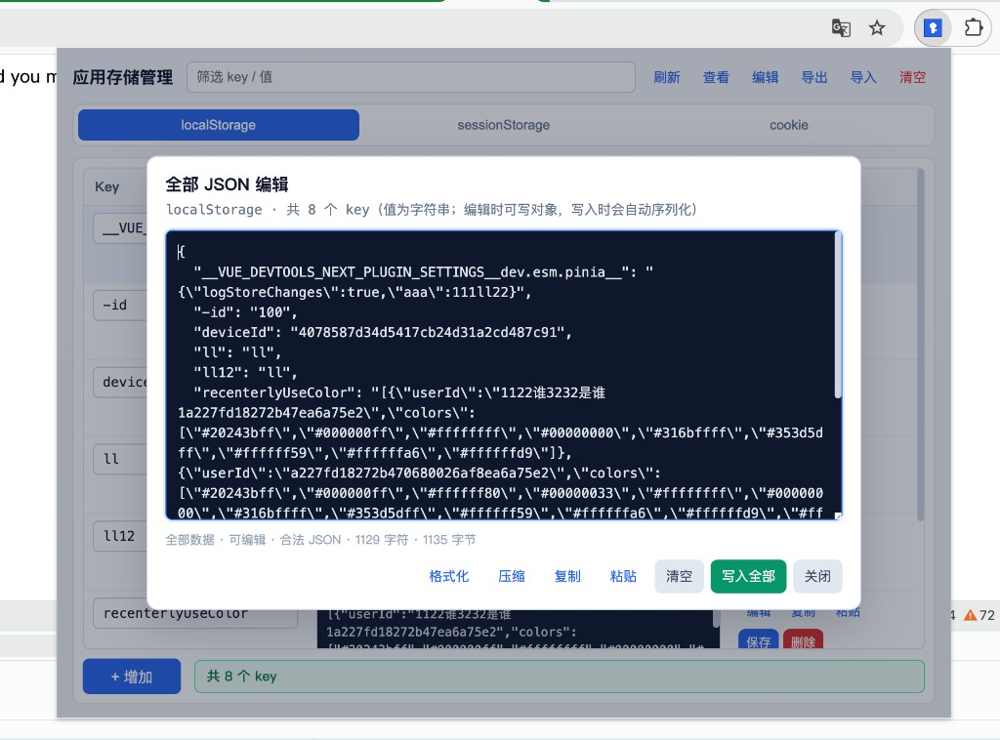

# 应用存储管理

Chrome Manifest V3 浏览器扩展（仓库目录：`storageInspector`，npm 包名：`storage-inspector`）：在弹窗中表格化管理当前页面的 **localStorage**、**sessionStorage** 与 **Cookie**（含 HttpOnly、分区 Cookie）。

当前版本：`2.1.7`

## 界面预览

主界面（localStorage 表格）：


筛选下拉（最近筛选 + 当前 Key，可清除历史）：



全部 JSON 编辑：



## 安装（开发者模式）

1. 打开 Chrome，访问 `chrome://extensions`
2. 开启右上角「开发者模式」
3. 点击「加载已解压的扩展程序」
4. 选择本仓库根目录（含 `manifest.json`）

修改代码后，在扩展管理页点击「重新加载」即可生效。若变更了权限（如剪贴板），必须重新加载扩展。

---

## 功能一览

| 区域 | 说明 |
|------|------|
| 顶栏筛选 | 按 Key / 值筛选；自绘下拉：最近 5 次筛选 + 当前页 Key；输入框 × 清空当前筛选词；「最近筛选」旁可**清除**历史 |
| 顶栏操作 | 刷新、查看（全部 JSON 只读）、编辑（全部 JSON）、导出、导入、清空 |
| Tabs | localStorage / sessionStorage / cookie；记住上次类型；方向键可切换 |
| Cookie 属性栏 | Path、Max-Age、Domain、SameSite、Secure、HttpOnly；跟随**当前选中行** |
| 主表格 | Key / 值可直接改；行内：编辑、复制、粘贴、保存、删除；草稿 / 未保存 / Cookie 徽章 |
| 表底 | 「+ 增加」草稿行；状态提示 |
| JSON 弹窗（单行） | 格式化 / 压缩 / 复制 / 粘贴 / 清空 / 保存 / 删除 |
| JSON 弹窗（全部） | 查看或批量编辑整表数据，见下文 |

---

## 使用说明

### 筛选

- 匹配范围：Key 或值；Cookie 还可匹配 Path / Domain
- 下拉默认展示完整备选（不随输入过滤选项），便于点选
- **最近筛选**：Enter 或点选建议时写入历史（最多 5 条）；标题旁「清除」只清历史，不清当前输入
- 输入框右侧 ×：清空当前筛选关键字并刷新表格

### 表格行操作

| 操作 | 行为 |
|------|------|
| 保存 | 写入当前页存储；local/session **改 Key = 重命名**（先写新 key，成功后再删旧 key） |
| 删除 | 删除该条目（Cookie 按 Path / Domain / 分区精确删） |
| 编辑 | 打开单行 JSON 弹窗 |
| 复制 / 粘贴 | 剪贴板读写值 |
| + 增加 | 新增草稿行，保存后才真正写入 |

- 合法 JSON 保存时会自动压缩为一行
- **单行保存拒绝空字符串**；要清空请用「删除」或顶栏「清空」
- 「未保存」徽章只跟踪 Key / 值；Cookie 属性另有切行确认

### 全部 JSON（查看 / 编辑）

| 类型 | 编辑格式 |
|------|----------|
| localStorage / sessionStorage | `{ "key": "value", ... }`（值均为字符串；编辑时可写对象，写入时自动序列化） |
| Cookie | 推荐 `cookies[]` 详情数组；也可用 `{ name: value }` 兼容模式（共用属性栏，无法表达同名多 Path） |

**写入全部（local / session）要点：**

1. 只覆盖 JSON 里出现的条目
2. 若页面中还有 JSON **未包含**的已有 key（常见于在 JSON 里**改名**或删掉某项），会二次确认是否**删除这些旧 key**
3. 若不删旧 key：新名写进去、旧名仍残留，看起来像「改了 key 不生效」
4. `{}` / `[]` **不等于**清空整表；清空请用顶栏「清空」

Cookie「写入全部」按条 upsert，不会按「JSON 缺失」批量删旧项。

### Cookie

- 通过 `chrome.cookies` API 读写，支持 **HttpOnly** 与 **分区 Cookie（CHIPS）**
- 列表用 `partitionKey: {}` 同时拉取未分区与分区罐
- 行上徽章：Path / Domain / HttpOnly / Secure / **分区**
- 属性栏改完后须点该行「保存」；切到其它行若属性未保存会提示
- 同 identity 更新：先 `set` 覆盖，成功后再按需处理；改 Key 或 Path/Domain 时写入新 identity 后再删旧条目
- UI **不能新建**分区 Cookie；可编辑 / 导入已有分区条目

### 导入 / 导出

导出为 JSON **v2**。

| 字段 | 说明 |
|------|------|
| `data` | 兼容用 `{ key: value }`；Cookie 下同名多 Path **只保留第一条** |
| `cookies` | Cookie 完整详情数组（同名多 Path 不合并）；**导入 Cookie 请优先用此字段** |

导入规则：

- `{ cookies: [...] }`：按每条自身 Path / Domain / 分区精确写入；非 cookie Tab 时会询问是否切换
- `{ data }` / 纯对象：按当前类型写入；Cookie 用属性栏选项
- 空字符串值会跳过；文件类型与当前 Tab 不一致时二次确认

### 未保存与确认

| 操作 | 行为 |
|------|------|
| 切换 Tab / 刷新 / 导出 / 导入 / 全部 JSON 写入 | 有未保存 Key/值、草稿或 Cookie 属性改动时，先确认是否丢弃 |
| 清空 | 单次确认；确认前不刷新，取消可保留编辑 |
| 切 Cookie 行 | 属性栏相对已写入结果有改动时提示 |
| JSON 弹窗关闭 | 编辑态有未保存修改时确认是否丢弃 |
| 全部 JSON 写入（local/session） | 若有缺失的已有 key，再确认是否删除旧 key |

---

## 使用提示

- 系统页、扩展页、Chrome 应用商店页（含 `chromewebstore.google.com`）通常无法读写
- 站点若持续 `Set-Cookie` / 脚本重写存储，保存后刷新仍可能被改回
- Chrome 弹窗高度约有上限（约 600px），属浏览器限制

## 已知限制

- `{ name: value }` 兼容模式无法管理同名多 Path；请用 `cookies[]` 或表格
- UI 无法新建分区 Cookie
- 空值：导入 / 全部 JSON 会跳过，不会用空串删除已有项
- 极旧 Chrome 可能不支持 `partitionKey`（会自动回退）
- 主逻辑集中在 `popup/index.js`，尚未拆模块

---

## 目录结构

```text
.
├── manifest.json
├── icons/
├── docs/
│   ├── screenshot.png
│   ├── screenshot-filter.png
│   └── screenshot-json.png
├── popup/
│   ├── index.html
│   ├── index.css
│   └── index.js
├── LICENSE
└── README.md
```

## 权限说明

| 权限 | 用途 |
|------|------|
| `activeTab` / `scripting` | 读写 localStorage / sessionStorage |
| `cookies` | 读写 Cookie（含 HttpOnly / 分区） |
| `storage` | 扩展本地状态（上次类型、筛选历史等） |
| `clipboardRead` / `clipboardWrite` | 复制 / 粘贴 |
| 主机权限 `http(s)://*/*` | 访问各站点 Cookie |

## License

[MIT](./LICENSE)
