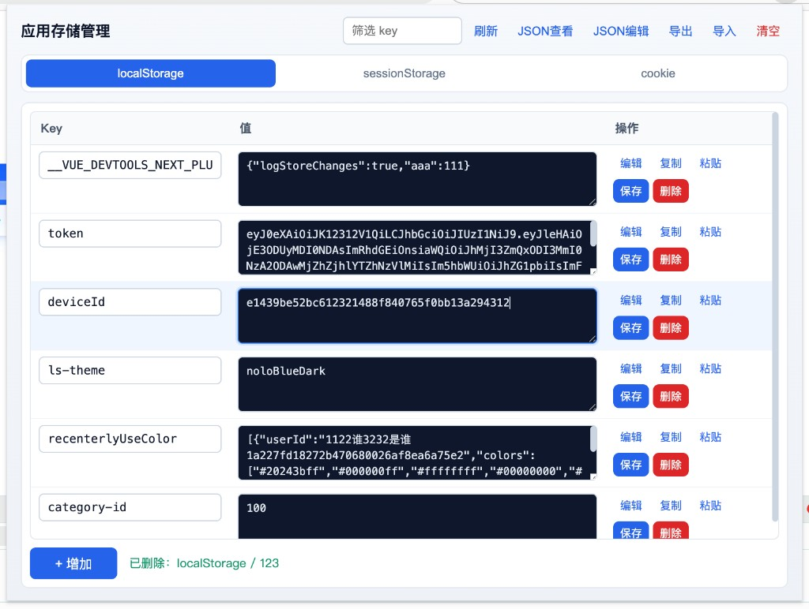

# 应用存储管理

Chrome Manifest V3 浏览器扩展，用于管理当前页面的 **localStorage**、**sessionStorage** 与 **Cookie**（含 HttpOnly）。

当前版本：`2.0.4`

## 界面预览



## 功能

- **表格化管理**：三列 Key / 值 / 操作，可在表格内直接改 Key 与值
- **行内操作**：编辑、复制、粘贴、保存、删除
- **单行 JSON 编辑**：打开大弹窗自动格式化；支持格式化 / 压缩 / 复制；「应用到行」时合法 JSON 自动压缩
- **全部 JSON**：工具栏「JSON查看 / JSON编辑」，以 `{ key: value }` 查看或批量改写当前类型全部数据
- **清空**：一键删除当前类型下全部条目（需确认）
- **导入 / 导出** JSON（Cookie 可带完整属性）
- Cookie 支持 Path、Domain、Max-Age、SameSite、Secure、**HttpOnly**（属性栏随选中行回填）
- 表格底部 **+ 增加** 草稿行，填写后保存写入

## 功能落位

| 功能 | 位置 |
|------|------|
| 存储类型切换 | 顶部 Tabs（localStorage / sessionStorage / cookie） |
| 筛选 Key | 标题右侧搜索框 |
| 刷新 / JSON查看 / JSON编辑 / 导出 / 导入 / 清空 | 标题右侧工具栏 |
| Cookie 属性 | Tabs 下方属性栏（选中行回填；新增用栏内默认值） |
| 浏览与编辑全部条目 | 主表格 |
| 单行 JSON 编辑 | 行内「编辑」 |
| 复制 / 粘贴 / 保存 / 删除 | 行内「操作」列 |
| 新增条目 | 表格底部「+ 增加」 |

## 安装（开发者模式）

1. 打开 Chrome，访问 `chrome://extensions`
2. 开启右上角「开发者模式」
3. 点击「加载已解压的扩展程序」
4. 选择本仓库根目录（包含 `manifest.json` 的目录）

修改代码后，在扩展管理页点击「重新加载」即可生效。若变更了权限（如剪贴板），必须重新加载扩展。

## 目录结构

```text
.
├── manifest.json      # 扩展清单
├── icons/             # 扩展图标
├── docs/              # 文档资源
│   └── screenshot.png
├── popup/             # 弹窗 UI
│   ├── index.html
│   ├── index.css
│   └── index.js
├── LICENSE
└── README.md
```

## 权限说明

| 权限 | 用途 |
|------|------|
| `activeTab` / `scripting` | 在当前页读写 localStorage / sessionStorage |
| `cookies` | 读写 Cookie（含 HttpOnly） |
| `storage` | 保存历史 Key、最近类型等扩展本地状态 |
| `clipboardRead` / `clipboardWrite` | 弹窗内复制 / 粘贴按钮 |
| 主机权限 `http(s)://*/*` | 访问各站点 Cookie |

## 使用提示

- 系统页（如 `chrome://`）、扩展页、应用商店页不支持读写
- Cookie 同名多 Path 时，先选中对应行（确认 Path / Domain 徽章）再删或改，以确保精确匹配
- Cookie 属性栏（HttpOnly / Secure 等）改完后需点该行「保存」才会写入；行上徽章表示当前已生效属性
- `__Host-` / `__Secure-` 前缀 cookie 会强制 Secure（`__Host-` 还会强制 Path=/ 且无 Domain）
- 写入空字符串会被拒绝；删单条用「删除」，清空当前类型用工具栏「清空」
- localStorage / sessionStorage 在表格内改 Key 后保存，会按「重命名」处理（删旧写新）
- 行内「编辑」打开时自动格式化；「应用到行」与「保存」会对合法 JSON 自动压缩
- 全部「JSON编辑」写入时只覆盖对象中出现的 key，不会删除未出现的 key

## License

[MIT](./LICENSE)
